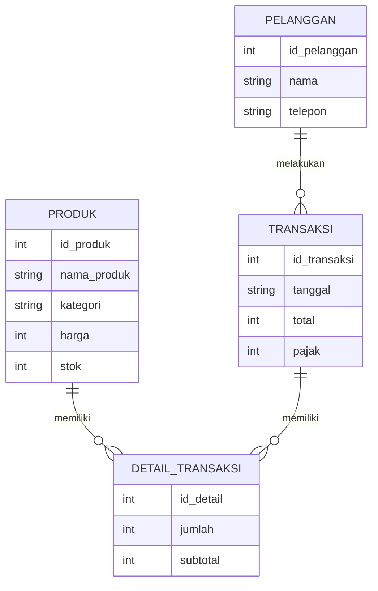

# KOPI KITA - POS Dashboard

## Deskripsi Project

KOPI KITA merupakan aplikasi Point Of Sales (POS) berbasis web yang digunakan untuk membantu proses transaksi pada coffee shop atau cafe. Sistem ini dirancang dengan tampilan modern, minimalis, dan user-friendly agar memudahkan kasir dalam melakukan transaksi penjualan produk.

Project ini berfokus pada Client-Side Programming menggunakan HTML, CSS, dan JavaScript tanpa menggunakan backend database. Data yang digunakan bersifat mock data/simulasi.

---

# Konsep UI/UX

## Tema Design
Glassmorphism & Modern Dashboard

## Konsep Tampilan
- Tampilan modern dan clean
- Menggunakan card product interaktif
- Dominasi warna cream, putih, dan orange kopi
- Rounded corner pada card dan button
- Responsive layout
- User-friendly untuk kasir cafe

---

# Design System

## Color Palette

| Fungsi | Warna |
|--------|--------|
| Primary | #E67E00 |
| Background | #F5F5F5 |
| Card Background | #FFFFFF |
| Text Primary | #1E1E1E |
| Text Secondary | #777777 |
| Border | #E5E5E5 |

---

## Typography

| Elemen | Font |
|--------|------|
| Heading | Poppins |
| Body Text | Inter |

---

# Struktur Navigasi

## Navbar
- POS
- Riwayat
- Dashboard

---

# Struktur Halaman

## 1. Halaman POS
Halaman utama transaksi kasir yang menampilkan daftar menu produk cafe.

### Fitur:
- Category filter
- Product card
- Add to cart
- Cart sidebar
- Subtotal otomatis
- Pajak otomatis
- Total pembayaran
- Tombol checkout

---

## 2. Halaman Dashboard
Halaman statistik penjualan.

### Fitur:
- Total transaksi
- Total pendapatan
- Grafik penjualan
- Produk terlaris
- Statistik pelanggan

---

## 3. Halaman Data Produk
Halaman untuk mengelola data produk.

### Fitur:
- Tabel produk
- Tambah produk
- Edit produk
- Hapus produk
- Search produk
- Filter kategori

---

## 4. Halaman Riwayat
Halaman daftar transaksi sebelumnya.

### Fitur:
- Detail transaksi
- Tanggal transaksi
- Total pembayaran
- Status pembayaran

---

# Komponen UI

## Navbar
Digunakan untuk navigasi antar halaman sistem.

---

## Category Button
Digunakan untuk memfilter produk berdasarkan kategori.

Kategori:
- Semua
- Kopi
- Non-Kopi
- Makanan
- Snack

---

## Product Card
Menampilkan:
- gambar produk
- nama produk
- harga produk
- tombol tambah produk

---

## Cart Sidebar
Menampilkan:
- daftar pesanan
- subtotal
- pajak
- total pembayaran
- tombol proses pembayaran

---

## Statistik Card
Menampilkan ringkasan data pada dashboard.

---

## Table Data
Digunakan untuk menampilkan data produk dan riwayat transaksi.

---

# User Flow

## Alur Transaksi POS

1. Kasir membuka halaman POS
2. Kasir memilih kategori produk
3. Kasir memilih produk
4. Produk masuk ke keranjang
5. Sistem menghitung subtotal dan pajak
6. Kasir menekan tombol pembayaran
7. Data transaksi masuk ke riwayat transaksi

---

# ERD

---

# Halaman Yang Akan Dibuat

1. Login Admin
2. Dashboard
3. POS Page
4. Data Produk
5. Form Produk
6. Riwayat Transaksi
7. Laporan Penjualan

---

# Tools Yang Digunakan

| Tools | Fungsi |
|-------|---------|
| Figma | UI Design |
| HTML5 | Struktur Website |
| CSS3 | Styling |
| JavaScript | Interaktivitas |
| Chart.js | Grafik Dashboard |
| Boxicons | Icon |
| VS Code | Code Editor |

---

# Link Figma

https://www.figma.com/make/hVVvLF0hbJ5EmwcCQfb3x6/Coffeeshop-POS-Dashboard?t=TWJ99eUUfOMFFUwA-1

---

# Screenshot Design

